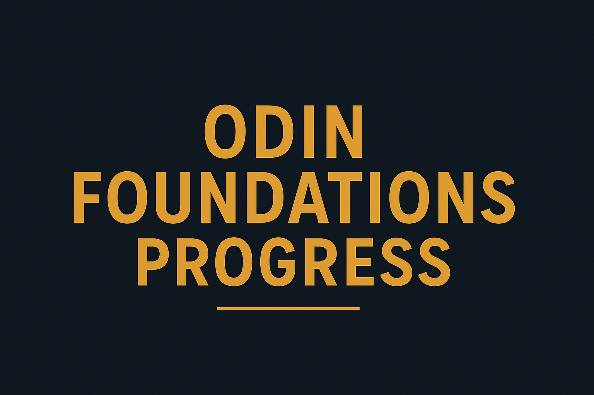

# Odin Foundations Progress

---

## 📖 About

This repository contains my progress and notes from working through **The Odin Project: Foundations Course**.  
It serves as a personal learning log, knowledge base, and reference as I build core web development skills.  

---

## 📂 Contents

- **progress/** – Chapter notes & exercises (`.md` files)  
- **FOUNDATIONS_PROGRESS.md** – Tracker for completed lessons & milestones  
- **README.md** – Overview of the project (this file)  
- **LICENSE** – MIT License  

---

## 🎯 Goals

- Gain solid understanding of **Git & GitHub workflows**  
- Build fundamentals in **HTML & CSS**  
- Understand **Flexbox layout techniques**  
- Learn **JavaScript basics**  
- Practice documentation with **Markdown**  

---

## ✅ Progress

Check my detailed progress tracker here:  
👉 [FOUNDATIONS_PROGRESS.md](FOUNDATIONS_PROGRESS.md)

---

## 📝 Notes

- This repo is **not a finished project**, but a learning companion.  
- Mistakes, revisions, and experiments are part of the journey.  

📘 [Commit Message Conventions](notes/COMMIT_CONVENTIONS.md)

---

## 🔗 Connect

- 🌍 [The Odin Project](https://www.theodinproject.com)  
- 🐙 [My GitHub Profile](https://github.com/tigrecoding)  

---

## ⚖️ License

This project is licensed under the terms of the [MIT License](LICENSE).  

